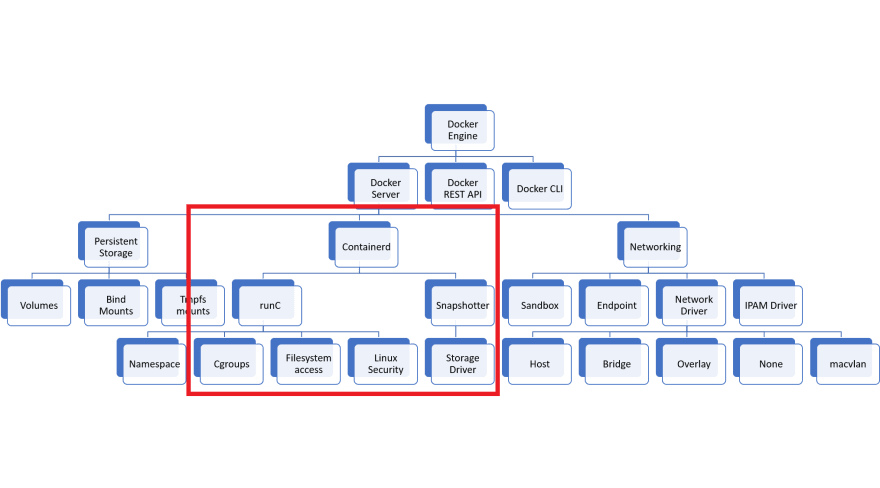
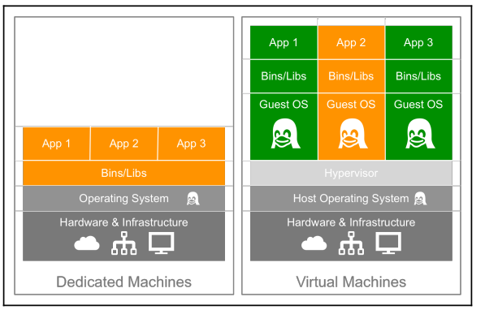
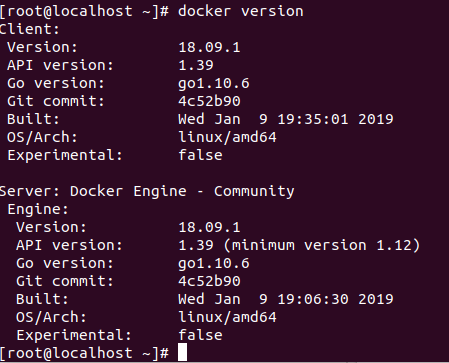

# Un poco de Historia

CC por [Bartolomé Sintes Marco](http://www.mclibre.org/consultar/webapps/index.html)

[Docker](https://www.docker.com) es un sistema de virtualización de aplicaciones mediante contenedores, creado por Solomon Hykes y otros ingenieros. En 2013 se convirtió en un proyecto de software libre (licencia Apache) en el que participan cada vez más empresas. La versión 1.0 se publicó en junio de 2014 y ha tenido un desarrollo muy rápido.

En marzo de 2017, Docker anunció un desarrollo todavía más rápido, pasando a publicar una nueva versión cada mes. La numeración de las versiones adoptó al formato AA.MM (año y mes). Estas versiones mensuales se han estado manteniendo solamente durante un mes, aunque cada trimestre una de esas versiones, se mantiene mantenido durante cuatro meses (la primera fue Docker 17.03).

En julio de 2018, Docker anunció que volvían a un desarrollo más pausado. Por un lado, se dejaron de publicar las versiones mensuales (aunque se publica una versión diaria inestable) y que a partir de Docker 18.09, en vez de una versión "estable" cada tres meses habrá una versión "estable" cada seis meses que se mantendrá durante siete meses.

Docker ofrece una versión Enterprise (de pago) y una versión Community (gratuita). La diferencia radica en el nivel de soporte y certificación que proporciona Docker a la versión Enterprise.


Docker empezó estando disponible solamente para distribuciones GNU/Linux, pero desde junio de 2016 también está disponible como aplicación nativa en Windows Server 2016 y Windows 10.

Docker utiliza la virtualización ofrecida por el sistema operativo. En el caso de Windows 10, eso significa que para usar Docker de forma nativa hay que activar Hyper-V (solo posible en windows profesional, no esta en windows Home) que, por desgracia, es incompatible con VirtualBox. Para poder utilizar Docker en Windows 7 o en Windows 10 sin Hyper-V, Docker ofrece desde agosto de 2015 [Docker Toolbox](https://github.com/docker/toolbox), que realmente es una máquina virtual (que se ejecuta en VirtualBox) que contiene Docker.

Los contenedores se distinguen de las máquinas virtuales en que las máquinas virtuales emulan un ordenador físico en el que se instala un sistema operativo completo, mientras que los contenedores usan el kernel del sistema operativo anfitrión pero contienen las capas superiores (sistema de ficheros, utilidades, aplicaciones).

Al ahorrarse la emulación del ordenador y el sistema operativo de la máquina virtual, los contenedores son más pequeños y rápidos que las máquinas virtuales. Pero al incluir el resto de capas de software, se consigue el aislamiento e independencia entre contenedores que se busca con las máquinas virtuales.

Los contenedores son útiles en los servidores, pero también para pruebas de software, ya que incluyen todos los elementos que necesitan las aplicaciones, lo que facilita la instalación y elimina los problemas de incompatibilidad de versiones en bibliotecas y aplicaciones auxiliares. También podría utilizarse para la distribución de software en general, pero en ese caso juega en contra la duplicidad que supone el que cada contenedor incluye todas las capas de software.


## Aprender más

- [Documentación oficial de Docker](https://docs.docker.com/engine/userguide/intro/)
- [Documentación de Docker Toolbox](https://docs.docker.com/toolbox/overview/)
- [Docker Labs: Tutoriales de Docker](https://github.com/docker/labs)
- Release Notes: [17.03](https://docs.docker.com/engine/release-notes/#17033-ce) - 17.04 - 17.05 - 17.06 - 17.07 - 17.09 - 17.10 - 17.11 - 17.12 - 18.01 - 18.02 - - 18.03 - [18.04](https://docs.docker.com/engine/release-notes/#18040-ce) - [18.05](https://docs.docker.com/engine/release-notes/#18050-ce) - [18.06](https://docs.docker.com/engine/release-notes/#18061-ce) - [18.09](https://docs.docker.com/engine/release-notes/#1809)
- GitHub Release Notes: [18.06](https://github.com/docker/docker-ce/releases/tag/v18.06.0-ce) - [18.09](https://github.com/docker/docker-ce/releases/tag/v18.09.0)
- Novedades: Docker [1.12](https://blog.docker.com/2016/07/docker-built-in-orchestration-ready-for-production-docker-1-12-goes-ga/) - [Docker 1.13](https://blog.docker.com/2017/01/whats-new-in-docker-1-13/) - [Docker 17.06 CE](https://blog.docker.com/2017/06/announcing-docker-17-06-community-edition-ce/)
- [Containers from scratch](https://ericchiang.github.io/post/containers-from-scratch/)
- [An executive's guide to containers (25/01/17)](https://opensource.com/article/17/1/container-strategy-for-executives)
- [Play with Docker Classroom](https://training.play-with-docker.com/)
- [User Namespaces](https://raesene.github.io/blog/2016/02/04/Docker-User-Namespaces/)


# Como Instalar
[Como instalar](https://docs.docker.com/install/)

Descripción general de Docker
Docker es un sistema de administración de contenedores que nos ayuda a administrar fácilmente los Contenedores de Linux (LXC) de una manera más fácil y universal. Esto le permite crear imágenes en entornos virtuales en su ordenador portátil y ejecutar comandos contra ellos. Las acciones que realice en los contenedores que ejecute en estos entornos localmente en su propia máquina serán los mismos comandos u operaciones que ejecute contra ellos cuando se ejecuten en su entorno de producción.

Esto ayuda a no tener que hacer las cosas de manera diferente cuando pasa de un entorno de desarrollo como el de su máquina local a un entorno de producción en su servidor. Ahora, echemos un vistazo a las diferencias entre los contenedores de Docker y los entornos típicos de máquinas virtuales.
La siguiente ilustración muestra la diferencia entre un servidor dedicado y no especializado y un servidor que ejecuta máquinas virtuales:


## Instalación de Docker
[Cambia a menudo pasarse por la fuente](https://docs.docker.com/get-docker/)

Dependiendo del sistema operativo utilizado, realizar la instalación de Docker y docker-compose (sólo Linux)

- Windows
- MacOS
- Linux (CentOS, Debian, Ubuntu, Fedora).

### CentOS 7+
```
sudo yum install -y yum-utils device-mapper-persistent-data lvm2
sudo yum-config-manager --add-repo https://download.docker.com/linux/centos/docker-ce.repo
sudo yum install docker-ce
sudo systemctl start docker
```

### Ubuntu 16.04+

```
sudo apt-get update
sudo apt-get install apt-transport-https ca-certificates curl software-properties-common
curl -fsSL https://download.docker.com/linux/ubuntu/gpg | sudo apt-key add -
sudo apt-get install docker-ce
```

### Post-instalación (sólo Linux)

Docker-compose En sistemas Linux, es necesario instalar docker-compose adicionalmente:
```
sudo curl -L https://github.com/docker/compose/releases/download/1.22.0/docker-compose-$(uname -s)-$(uname -m) -o /usr/local/bin/docker-compose
sudo chmod +x /usr/local/bin/docker-compose
```
Identificamos la versión de docker-compose para verificar su funcionamiento.

    $ docker-compose --version

Versión de docker-compose

Finalmente, se crea un grupo docker y se agrega el usuario actual para poder ejecutar comandos sin necesidad de ser usuario root.
```
    # sudo groupadd docker
    # sudo usermod -aG docker $USER
```

Reiniciamos la sesión en el sistema. En caso de utilizar una máquina virtual es necesario reiniciarla para que los cambios surtan efecto.

Si la instalación se realizó correctamente, ejecutamos el siguiente comando para levantar el contenedor hello-world: docker run hello-world

## Diagrama básico de la arquitectura de docker



No es lo mismo docker(producto) docker-ce o containerD.

Estos proyectos los tienes en la CNCF  [Cloud Native Interactive Landscape](https://landscape.cncf.io/)


## Algunos tips

Crea el grupo docker si no existe ya:
```
    # groupadd --system docker

    Edita /etc/sysconfig/docker y añade -G docker a OPTIONS
    Añade tu usuario al grupo docker:

    # usermod -aG docker tu_usuario

    Reinicia docker:

    # systemctl restart docker

    Cierra y abre tu sesión
```

Quizá prefieras usar el grupo wheel (los que tienen acceso a sudo) y te ahorras los pasos de crear el grupo.



Con las nuevas versiones (y es importante sobre todo si usas los repositorios oficiales y no los de tu distribución), la ubicación por defecto de la configuración de Docker Engine es /etc/docker/daemon.json, y sí, efectivamente se trata de un fichero JSON.

Aunque se nos proporciona una plantilla para que sepamos de qué opciones dispone, esta es la mía (Fedora de desarrollo local), por si sirve a alguien:
```
{
    "group": "wheel",
    "icc": false,
    "log-driver": "journald",
    "selinux-enabled": true,
    "storage-driver": "overlay2"
}
```
Creo que son las configuraciones más importantes:

- Ya que usar Docker equivale a ser root en muchos casos, usar el grupo wheel te facilita la tarea: todos los administradores tienen acceso al socket de Docker por defecto.
- Deshabilitar icc (Inter-Container Communication) hace que los contenedores solo se puedan comunicar entre sí si comparten un link o una red. Normalmente en producción ha de ser así, así que mejor te vas acostumbrando en desarrollo.
- Los otros controladores de almacenamiento siempre me han dado errores, overlay2 funciona de maravilla.
- journald es el único controlador de registros con soporte completo y que no te infla el sistema hasta quedarse sin espacio, como hace el json-file que viene por defecto.
- SELinux es importante tenerlo activado siempre que se pueda.


## Instalación en Linux 

Abrimos un entorno shell y en modo superusuario podemos hacer la instalación par un ubuntu

```
$ curl -sSL https://get.docker.com/ | sh
$ sudo systemctl start docker
```
Para activarlo al inicio de la maquina:
```
$ sudo systemctl enable docker
```

Podemos ver si esta intalado y funcionando:

```
$ docker version # Nos tiene que mostar la version del Cliente y del server
$ docker help
$ docker container run hello-world
$
$ docker image pull nginx
$ docker container run -d --name nginx-test -p 8080:80 nginx
```


El primero de los dos comandos descarga la imagen del contenedor NGINX, y el segundo lanza un contenedor en el fondo llamado nginx-test usando la imagen nginx que tirado. También asigna el puerto 8080 en nuestra máquina host al puerto 80 en el contenedor, haciéndolo
accesible a nuestro navegador local en este [enlace](http://localhost:8080/)




Necesitaremos utilidades para la gestión de  docker para lo que instalaremos [docker-compose](https://docs.docker.com/compose/install/) y tambien instalaremos [docker-machine](https://docs.docker.com/machine/install-machine/).


# Algunos comandos de Docker

### Algunos comandos de Docker
#
[Docker Cheat Sheet](https://github.com/wsargent/docker-cheat-sheet)
Una vez instalado Docker, todo se gestiona mediante comandos, que en Ubuntu se deben ejecutar como administrador:

```
    $ sudo docker COMANDOS
```
Para ver los comandos disponibles (en general y en particular):
```
    $ sudo docker
    $ sudo docker image
    $ sudo docker network

```
Para ver las opciones de cada comando:
```
    $ sudo docker cp --help
```
Los comandos tienen a su vez opciones. Los nombres de las opciones van precedidas de los caracteres --y entre la opción y su valor se puede escribir un espacio o el carácter =.
```
    sudo docker COMANDO --OPCION=VALOR
    sudo docker COMANDO --OPCION VALOR
```
Si el valor de una opción contiene espacios, escriba el valor entre comillas
```
    sudo docker COMANDO --OPCION="VALOR CON ESPACIOS"
    sudo docker COMANDO --OPCION "VALOR CON ESPACIOS"
```

### Imágenes

En los comandos siguientes REPOSITORIO es el nombre del repositorio en el que se encuentra la imagen (por ejemplo usuario/phpmyadmin) e IMAGEN es el nombre de la imagen descargada. Realmente, las imágenes descargadas se llaman igual que los repositorios de donde se han descargado, pero he distinguido los nombres para dejar claro cuándo nos estamos haciendo referencia a la imagen del repositorio y cuándo a la imagen local.

Para gestionar las imágenes, se utiliza el comando:
```
sudo docker image OPCIONES
```
Para descargar una imagen:
```
sudo docker image pull REPOSITORIO
sudo docker pull REPOSITORIO
```
Para ver las imágenes ya descargadas:
```
sudo docker image ls
```
Para borrar una imagen (se deben borrar previamente los contenedores basados en esa imagen):
```
sudo docker image rm IMAGEN
```

### Contenedores
#
En los comandos siguientes CONTENEDOR es el nombre del contenedor, que podemos elegir al crearlo, y RED es el nombre de una red ya existente.

Para crear un contenedor (y ponerlo en marcha):
```
    sudo docker run --name=CONTENEDOR REPOSITORIO
```
El problema de este comando es que dejamos de tener acceso a la shell y sólo se puede parar el proceso desde otro terminal.
Lo habitual es poner en marcha el contenedor en modo separado (detached), es decir, en segundo plano, yasí podemos seguir utilizando la shell:

```
    sudo docker run -d --name=CONTENEDOR REPOSITORIO
```
Si queremos ver la secuencia de arranque del contenedor, podemos poner en marcha el contenedor en modopseudo-tty, que trabaja en primer plano, pero del que podemos salir con Ctrl+C.
```
    sudo docker run -t --name=CONTENEDOR REPOSITORIO
```
Al crear el contenedor se pueden añadir diversas opciones:

- Para incluir el contenedor en una red privada virtual (y que se pueda comunicar con el resto  de contenedores incluidos en esa red):
```
    sudo docker run --name=CONTENEDOR --net=RED REPOSITORIO
```
- Para que el contenedor atienda a un puerto determinado, aunque internamente atienda un puerto distinto:
```
    sudo docker run --name=CONTENEDOR -p PUERTO_EXTERNO:PUERTO_INTERNO REPOSITORIO
```
- Para establecer variables de configuración del contenedor:
```
    sudo docker run --name=CONTENEDOR -e VARIABLE=VALOR REPOSITORIO
```
- Las variables de configuración se pueden consultar en el repositorio del que obtenemos la imagen.

Para ver los contenedores en funcionamiento:
```
    sudo docker ps
```
Para ver los contenedores en funcionamiento o detenidos:
```
    sudo docker ps -a
```
Para detener un contenedor:
```
    sudo docker stop CONTENEDOR
```
Para detener todos los contenedores:
```
    sudo docker stop $sudo docker ps -aq)
```
Para borrar un contenedor:
```
    sudo docker rm CONTENEDOR
```
Para poner en marcha un contenedor detenido:
```
    sudo docker start CONTENEDOR
```
Para entrar en la shell de un contenedor:
```
    sudo docker exec -it CONTENEDOR /bin/bash
```
Para entrar en la shell del contenedor como root:
```
    sudo docker exec -u 0 -it CONTENEDOR /bin/bash
```
Para salir de la shell del contenedor:
```
    exit
```
Para copiar (o mover) archivos entre el contenedor y el sistema anfitrión o viceversa:
```
    sudo docker cp CONTENEDOR:ORIGEN DESTINO
    sudo docker cp ORIGEN CONTENEDOR:DESTINO
```

###  Redes
#
En los comandos siguientes RED es el nombre de la red privada.

Para gestionar las redes, se utiliza el comando:
``` 
    $ sudo docker network OPCIONES
```

Para crear una red:
```
    $ sudo docker network create RED
```
Para ver las redes existentes:
```
    $ sudo docker network ls
```
Para ver información detallada de una red (entre ella, los contenedores incluidos y sus IP privadas):
```
    $ sudo docker network inspect RED
```
Para borrar una red:
```
    $ sudo docker network rm RED
```

###  Sistema
# 
- Para ver el espacio ocupado por las imágenes, los contenedores y los volúmenes:
```
    sudo docker system df
```
- Para eliminar los elementos que no están en marcha:
    - Contenedores:
```
        sudo docker container prune
```
    - Imágenes:
```
        sudo docker image prune
```
    - Volúmenes:
```
        sudo docker volume prune
```
    - Redes:
```
        sudo docker network prune
```
    - todo:
``` 
        sudo docker system prune
```