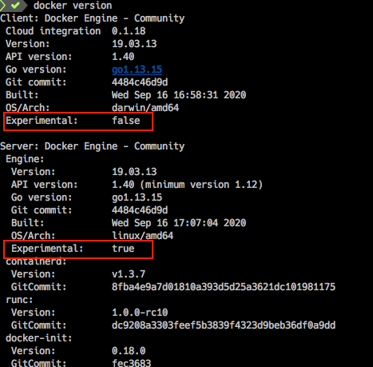
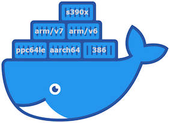

# Develop with Docker Experimental Feature

Para usar las caracteristicas experimentales en Docker hay que ajustar el servidor y el cliente de Docker, en esta imagen vemos como esta activado solo en uno de los dos: usamos `docker version`

Te indico como configurar cada uno de ellos.

##### Como activamos el server

Necesitas modifcar el fichero del servicio de la configuración

```
sudo vim /etc/docker/daemon.json
```

Añadimos el siguiente texto ( ten en cueta que puedes tener mas configuraciones, entoces respecta el formato json)

```
{ 
    "experimental": true 
} 
```

Guarda los cambios y reinicia el servidor (depende del sistema operativo puede cambiar )

```
sudo service docker restart
```

ya puedes confirmar que esta activo usando el comando 

```
docker version
```

En la parte de server tienes que encontrar `Experimental: true`




En mi mac se puede hacer editando desde preferencias:


##### Como activamos en el CLI

Podemos activalo de forma temporal para el cliente:

```
$ docker version
 Experimental:      false
$ export DOCKER_CLI_EXPERIMENTAL=enabled
$ docker version
 Experimental:      true
```

Si queremos que  sea de foma permanente debemos añadir en el fichero config.json  del CLI , en el server se llama igual el fichero ten cuidad es facil equivocarse

En el fichero `$ vim ~/.docker/config.json` 

Añadimos`"experimental" : "enabled"`

Ten en cuenta que es un json puede ser que necesites añadir {} o comas respecta el formato.


##### Con todas las dos opciones activadas.

Podemos también usar `docker version -f '{{.Server.Experimental}}'`

En este caso la salida de `docker version` marcado en rojo las caracteristitcas, se pueden ver como estan activadas.


# Características experimentales actuales

Hay que tener muy presente que las funciones experimentales experimentan cambios con las versiones. Estas características dan acceso anticipado a las funciones que pueden aparecer en versiones futuras. A veces, esas características se convierten en una versión final y, a veces, se desaparecen. 

Una búsqueda rápida de la documentación actual de Docker revela que las siguientes características están incluidas en la lista experimental ***no estan todas*** y por supuesto, esto podría cambiar en cualquier momento:

- [docker assemble](https://docs.docker.com/assemble/install/) es un complemento que proporciona una herramienta compatible con el framework-aware  para permitir a los usuarios crear una aplicación en un contenedor Docker optimizado. Con esta función, es posible crear rápidamente imágenes de Docker sin proporcionar información de configuración.
- [docker deploy](https://docs.docker.com/engine/reference/commandline/deploy/) es un alias para stack deploy. Esta función es compatible con la versión de fichero "compose" 3.0 y superior.
- [docker manifest inspect](https://docs.docker.com/engine/reference/commandline/manifest_inspect/) muestra un "manifest" de imagen o una lista de "manifiéstala".
- [docker checkpoint](https://docs.docker.com/engine/reference/commandline/checkpoint_create/) create crea un punto de control desde un contenedor en ejecución.
- [docker buildx](https://docs.docker.com/buildx/working-with-buildx/) es un complemento CLI que amplía el comando docker con las características (proporcionadas por [Moby BuildKit](https://github.com/moby/buildkit) ) como crear contenderos para distintas arquitecturas como ARM, compilar en varios nodos al mismo tiempo, recolección automática garaje, formatos frontend extensibles, importar / exportar caché de compilación y más.

También debe tenerse en cuenta que algunos de los comandos experimentales están disponibles para el motor docker estándar, mientras que otros solo están disponibles para los motores docker-ce o docker-ee.

Y así es como puede acceder a las funciones experimentales de Docker.


# Docker buildx 

[Crear images para distintas arquitecturas]





Con la aparicion de distaintas arquitecturas Intel Arm y Darwin, podemos necesitar característica. 

**BuildKit**  está diseñado para crear contenedores  para la construcción de múltiples plataformas y no solo para la arquitectura y el sistema operativo que el usuario que en  la que se ejecuta la construcción.


En el momento de escribir este artículo (principios de 2021), buildx es una función experimental. Si intenta usarlo sin activar las funciones experimentales, fallará:

```shell
$ docker buildx
docker: ‘buildx’ is not a docker command.
See ‘docker --help’
```


Cuando ejecuta **"buildx"**, puede establecer la marca `--platfor` para especificar la plataforma de destino para la salida de compilación (por ejemplo, `linux/amd6 linux/arm64 o darwin/amd64´.

Puedes crear imágenes multiplataforma utilizando tres formas diferentes que son compatibles con Buildx y Dockerfiles:

Dependiendo del proyecto, y la tecnología de su  lenguaje que utilice puede tener un  soporte para la compilación cruzada. 

Suponiendo que los contextos node-amd64 y node-arm64 existen en el

`docker context ls`

 ```shell
 $ docker buildx create --use --name mybuild node-amd64
 $ docker buildx create --append --name mybuild node-arm64
 $ docker buildx build --platform linux/amd64,linux/arm64 .
 ```

En ese caso, las compilaciones de múltiples etapas en los ficheros para usar en la contruccion "Dockerfiles" se pueden usar de manera efectiva para compilar binarios para la plataforma especificada con --platfor utilizando la arquitectura nativa del nodo de compilación. Una lista de argumentos de compilación como BUILDPLATFOR y TARGETPLATFOR está disponible automáticamente dentro de su Dockerfile y puede ser aprovechada por los procesos que se ejecutan como parte de su compilación.

```
# syntax=docker/dockerfile:syntax=docker/dockerfile:`1
FROM --platform=$BUILDPLATFORM golang:alpine AS build
ARG TARGETPLATFORM
ARG BUILDPLATFORM
RUN echo "I am running on $BUILDPLATFORM, building for $TARGETPLATFORM" > /log
FROM alpine
COPY --from=build /log /log
```


### Creando un Build con Buildx

Usando CLI con docker necesitamos crear una nueva instancia de constructor que buildx pueda usar:
```shell
$ docker buildx create --name mybuilder
mybuilder
$ docker buildx use mybuilder
````

Podemos ver que esta funcionando perfectamente:

`$ docker buildx inspect --bootstrap`

Podemos ver en la salida.


Fijate en la ultima línea.

##### Usando build con buildx


Ya podemos crear imágenes de Docker de arquitectura múltiple con buildx. Para tener algo concreto con lo que trabajar, usaremos el siguiente ejemplo de este Dockerfile:

```
FROM alpine:latest
CMD echo “Running on $(uname -m)”
```
Ahora autenticaremos para dejar las imagesnes en nuestro repositorio, este caso usare Docker hub https://hub.docker.com/

´docker login -u marioezquerro´

Nos pedira la contraseña, si todo es correcto tenedremos un "Login Succeeded"

Ahora podemos crear las imagenes y subirlas al repositorio.

```shell
$ docker buildx build -t mario.ezquerro/buildx-test:latest --platform linux/amd64,linux/arm64,linux/ppc64le --push .
```
Si todo es correcto veremos la salia y la subida en el repositorio.


Nos encontraremos las imagesnes en el repositior las imagenes para las distintra plataformas creadas.


Bueno ya podemos usar esta images.

```shell
$ docker run --rm marioezquerro/buildx-test:latest
Unable to find image 'marioezquerro/buildx-test:latest' locally
latest: Pulling from marioezquerro/buildx-test
540db60ca938: Already exists
Digest: sha256:02db0fb4ab93de95b50b31031e886f435e731af71b0cf297976fbde3ab073b1d
Status: Downloaded newer image for marioezquerro/buildx-test:latest
“Running on x86_64”
```

Tambien podemos analizar la arquetectura en mi caso es un Mac con i5

```shell
$ docker inspect --format “{{.Architecture}}” marioezquerro/buildx-test:latest
"amd64"

$ docker run --rm --platform linux/aarch64  marioezquerro/buildx-test:latest”
“Running on x86_64”
```